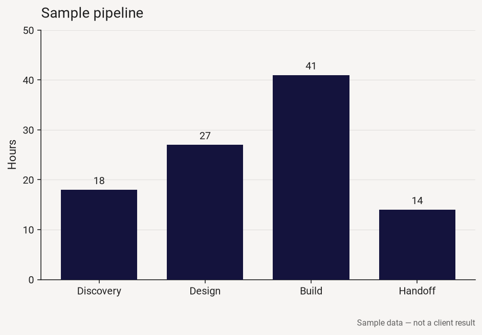
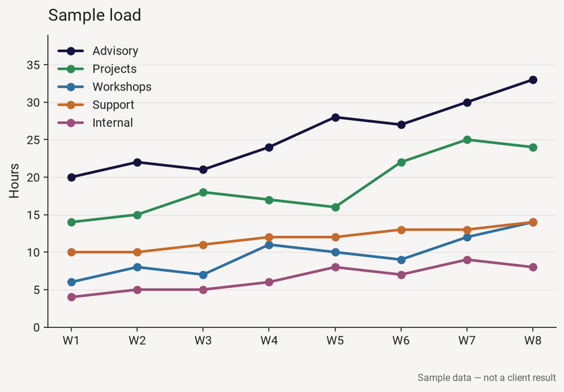
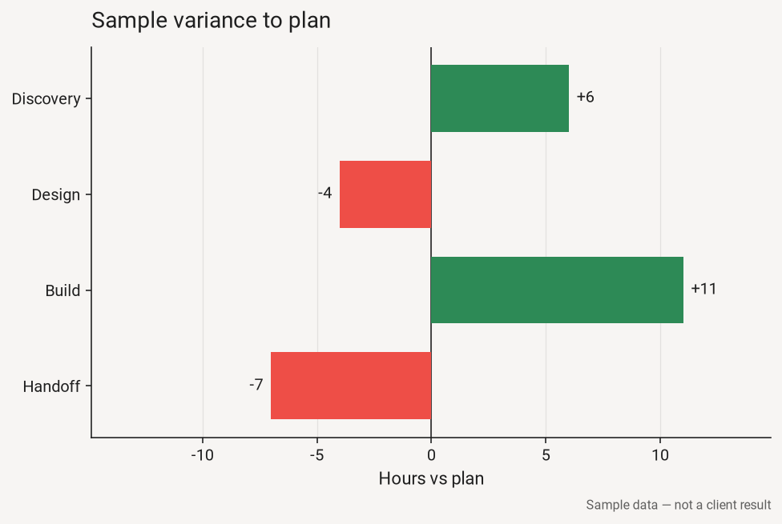

# chart-skills

Two Agent Skills from Dodge Labs for charts that stay honest.

**chart-ascii** draws bars, sparklines, and stacked composition as text. Chat, a terminal, markdown, email.

**chart-brand** turns a hex list into a matplotlib and seaborn theme: `brand.toml`, a `matplotlibrc`, and three proof figures.

GitHub: `DodgeLabs/chart-skills`.

## Install

Copy or symlink each skill directory. The agent reads `SKILL.md` and runs the scripts beside it, so the folder has to stay whole.

Claude Code loads `~/.claude/skills` for every project and `.claude/skills` for the current one. Cursor loads `~/.cursor/skills` and `.cursor/skills` the same way.

From a checkout of this repo:

```bash
mkdir -p ~/.claude/skills ~/.cursor/skills
ln -sfn "$PWD/skills/chart-ascii" ~/.claude/skills/chart-ascii
ln -sfn "$PWD/skills/chart-ascii" ~/.cursor/skills/chart-ascii
ln -sfn "$PWD/skills/chart-brand" ~/.claude/skills/chart-brand
ln -sfn "$PWD/skills/chart-brand" ~/.cursor/skills/chart-brand
```

To vendor the skills into another project, use the same links under that project's `.claude/skills/` and `.cursor/skills/`. From `.claude/skills/chart-ascii`, the relative target is `../../skills/chart-ascii`.

## ASCII

```bash
python3 skills/chart-ascii/scripts/render_bars.py \
  --title "Sample pipeline, hours" \
  --pairs "Discovery=18;Design=27;Build=41;Launch=180"
```

```text
Sample pipeline, hours

Discovery  ██████████████████░░░░░░░░░░░░░░░░░░░░░░░░░░░░░░░░   18
Design     ███████████████████████████░░░░░░░░░░░░░░░░░░░░░░░   27
Build      █████████████████████████████████████████░░░░░░░░░   41
Launch     ██████████████████████████████████████████████████  180  clipped

Clipped to the body of the data: Launch (180).
Scale 0–50 · width 50 · █░
```

Launch is clipped so the other bars stay readable. The scale line is part of the chart. Sparklines, stacked bars, the diverging form, and the ASCII fallback are in [examples/ascii-sample.md](examples/ascii-sample.md).

## Brand

The Dodge Labs demo uses the [dodgelabs.com](https://dodgelabs.com/) tokens. Navy and green are series colors. Red is the accent and the down color. The highlight yellow is a wash. Three further series colors are chart extensions so a multi-series figure has something other than navy and green. The `note` in [`skills/chart-brand/assets/dodge-demo.toml`](skills/chart-brand/assets/dodge-demo.toml) names which hex is which.

```bash
python3 skills/chart-brand/scripts/write_matplotlibrc.py \
  --theme skills/chart-brand/assets/dodge-demo.toml \
  --out examples/brand-hex-sample
```

That command warns three times on this palette. Green is both a series and the up color. Red is both the accent and the down color. The yellow wash fails as a bar fill. One meaning per hue on a given chart.







A hex list you type takes the same path. The hexes are the series cycle, in the order you pass them.

```bash
python3 skills/chart-brand/scripts/write_matplotlibrc.py \
  --name "Acme" \
  --hex 14133D 2D8A56 \
  --out chart-theme
```

Colors taken from a stylesheet or a slide stay a proposal until a person confirms them. `palette_from_css.py` and `palette_from_image.py` print that proposal. `write_matplotlibrc.py` will refuse an unconfirmed file until you pass `--confirm`.

## Requirements

Python 3.9 or newer. Text charts and theme files use the standard library.

Proof PNGs need matplotlib. `palette_from_image.py` needs Pillow. Apply the theme with matplotlib. If you also use seaborn, load the `matplotlibrc` after `sns.set_theme`, because `set_theme` replaces the color cycle.

## v1 boundary

v1 writes files on disk: text charts, plus matplotlib and seaborn. Chart.js, hosted chart APIs, and MCP are outside this version. CSS extraction reads static stylesheets. It does not run JavaScript.

## License

MIT. Copyright Dodge Labs LLC. See [LICENSE](LICENSE).
